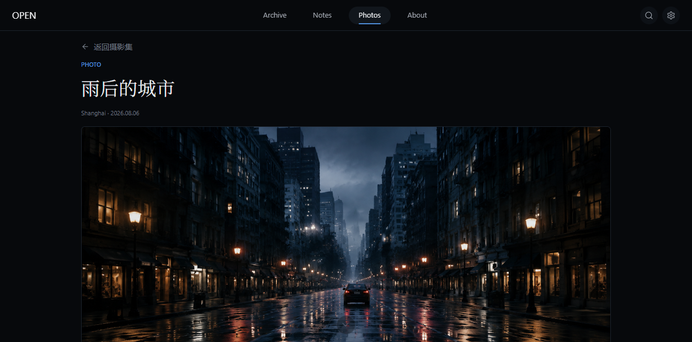
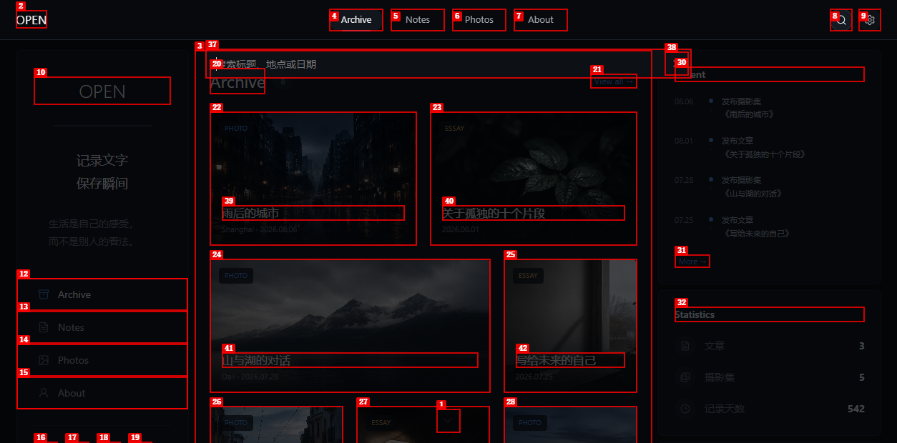

# Dogfood Report: WoodsChen

| Field | Value |
|-------|-------|
| **Date** | 2026-08-09 |
| **App URL** | http://127.0.0.1:4173/ |
| **Session** | woodschen-qa-20260809 |
| **Scope** | Public site and unauthenticated admin, desktop and mobile |

## Summary

| Severity | Count |
|----------|-------|
| Critical | 0 |
| High | 0 |
| Medium | 1 |
| Low | 0 |
| **Total** | **1** |

## Issues

### ISSUE-001: Opening global search from a photo detail loses the current route

| Field | Value |
|-------|-------|
| **Severity** | medium |
| **Category** | functional / ux |
| **URL** | http://127.0.0.1:4173/#/photos/rain-city |
| **Repro Video** | N/A (local ffmpeg is unavailable; screenshots capture the route transition) |

**Description**

The global search control should open without discarding the page the visitor is reading. On a photo detail, clicking Search changes the URL to `#/archive` and renders Archive behind the search field. Closing search therefore cannot return the visitor to the photo.

**Repro Steps**

1. Open the Rain City photo detail.
   

2. Click the Search icon in the global header.
   

3. **Observe:** the URL is now `#/archive`; the photo detail and its reading position are lost.

---
